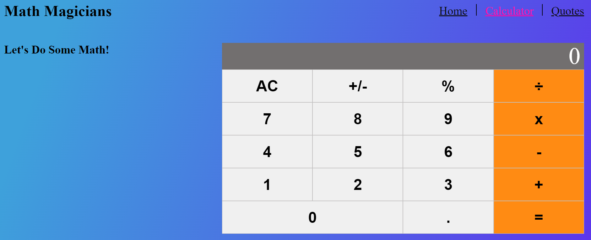

<a name="readme-top"></a>

<div align="center">
 <h3><b>Math-Magicians</b>.
 </h5>
</div>

<div align="center">
<h3><b>Screenshot</b></h3>


</div>

<!-- TABLE OF CONTENTS -->

# 📗 Table of Contents

- [📖 About the Project](#about-project)
  - [🛠 Built With](#built-with)
    - [Tech Stack](#tech-stack)
    - [Key Features](#key-features)
  - [🚀 Live Demo and presentation video](#live-demo)
- [💻 Getting Started](#getting-started)
  - [Setup](#setup)
  - [Prerequisites](#prerequisites)
  - [Install](#install)
  - [Usage](#usage)
  - [Run tests](#run-tests)
  - [Deployment](#triangular_flag_on_post-deployment)
- [👥 Authors](#authors)
- [🔭 Future Features](#future-features)
- [🤝 Contributing](#contributing)
- [⭐️ Show your support](#support)
- [🙏 Acknowledgements](#acknowledgements)
- [📝 License](#license)

<!-- PROJECT DESCRIPTION -->

## 📖 Math-Magicians <a name="about-project"></a>

**Math-Magicians** is the first project of the Math Magicians application with React</b>

<h5> I set up the environment and tools needed to develop a React application. In this project, I have made a simple SPA that contains three subpages - Made a simple calculator, made a random math-related quote, and Homepage.</h5>

## 🛠 Built With <a name="built-with"></a>

## Tech Stack <a name="tech-stack"></a>

<details>
  <summary>Client</summary>
  <b>This project only works client side right now.</b>
  <ul>
    <li>JSX</li>
    <li>CSS</li>
    <li>JS</li>
    <li>React</li>
  </ul>
</details>
<details>
  <summary>Server</summary>
  <ul>
    <li><a href=#>Server - It is Hosted on Render</a></li>
  </ul>
</details>

<details>
<summary>Database</summary>
  <ul>
    <li><a href=https://api-ninjas.com/api/quotes>Used API's Ninjas</a></li>
  </ul>
</details>

<!-- Features -->

## Key Features <a name="key-features"></a>

- [ ] **You can simple calculate by using calculator**
- [ ] **You can see random math related quotes**

<p align="right">(<a href="#readme-top">back to top</a>)</p>

<!-- LIVE DEMO -->

## 🚀 Live Demo<a name="live-demo"></a>

- [Live Demo Link](https://math-magicians-ufq5.onrender.com/)

<p align="right">(<a href="#readme-top">back to top</a>)</p>

<!-- GETTING STARTED -->

## 💻 Getting Started <a name="getting-started"></a>

To get a local copy up and running, follow these steps.

## Prerequisites <a name="prerequisites"></a>

- In order to run this project you need:

### It would be best if you had some familiarity with `JS`, `CSS`, and `React` .

- A Computer (MAC or PC)
- code editor (VSCode,Atom etc...)
- A browser (Chrome,Mozilla,Safari etc...)
- Version Control System (Git and Github)

# Setup <a name="setup"></a>

Clone this repository to your desired folder:

```bash
       git clone https://github.com/AbdusSattar-70/Math-Magicians.git
       cd Math-Magicians
```

# Install <a name="install"></a>

Install this project with:

```bash
     npm install
```

# Run tests and check errors <a name="run-tests"></a>

To run tests and check errors, run the following command:

- To check Styelint error:-

```bash
   npm test
```

```bash
   npx stylelint "\*_/_.{css,scss}"
```

- To check Eslint error:-

```bash
  npx exlint .
```

# Deployment <a name="triangular_flag_on_post-deployment"></a>

You can deploy this project using:

- render Hosting server.

```bash
   npm install
   npm run start
```

<p align="right">(<a href="#readme-top">back to top</a>)</p>

<!-- AUTHORS -->

## 👥 Authors <a name="authors"></a>

## 👤 Abdus Sattar

- GitHub: [AbdusSattar-70](https://github.com/AbdusSattar-70)
- Twitter: [Abdus Sattar](https://twitter.com/Abdus_Sattar70)
- LinkedIn: [Abdus Sattar](https://www.linkedin.com/in/abdus-sattar-a41a26215/)

<p align="right">(<a href="#readme-top">back to top</a>)</p>

<!-- FUTURE FEATURES -->

## 🔭 Future Features <a name="future-features"></a>

- [ ] **Web Responsiveness for all users**
- [ ] **Add web accessibility**
- [ ] **Add gradient background that will change randomly**

<p align="right">(<a href="#readme-top">back to top</a>)</p>

<!-- CONTRIBUTING -->

## 🤝 Contributing <a name="contributing"></a>

Everybody is welcome to suggest, changes,Contributions, issues, and feature request in this project.

In order to do it, fork this repository, create a new branch and open a Pull Request from your branch.

Feel free to check the [issues page](../../issues/).

<p align="right">(<a href="#readme-top">back to top</a>)</p>

<!-- SUPPORT -->

## ⭐️ Show your support <a name="support"></a>

If you like this project, Please give me ⭐️ and you can use it following [MIT](./LICENSE) license.

<p align="right">(<a href="#readme-top">back to top</a>)</p>

<!-- ACKNOWLEDGEMENTS -->

## 🙏 Acknowledgments <a name="acknowledgements"></a>

I would like to thank and appreciate who contributes this project.

<p align="right">(<a href="#readme-top">back to top</a>)</p>

<!-- LICENSE -->

## 📝 License <a name="license"></a>

This project is under [MIT](./LICENSE) licensed.

<p align="right">(<a href="#readme-top">back to top</a>)</p>
